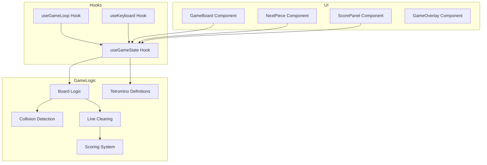

# Tetris Game - Requirements Specification

## 1. Overview

This document outlines the requirements for a classic Tetris game built as a modern web application using **React + TypeScript**. The game will run in a web browser and provide the authentic Tetris experience with standard mechanics.

---

## 2. Technology Stack

| Category | Technology |
|----------|------------|
| Frontend Framework | React 18+ |
| Language | TypeScript |
| Styling | CSS Modules / Tailwind CSS |
| Build Tool | Vite |
| Game Loop | `requestAnimationFrame` / React hooks |
| Package Manager | npm / pnpm |

---

## 3. Game Mechanics

### 3.1 Game Board

- Standard Tetris board: **10 columns x 20 rows**
- Each cell can be empty or contain a placed block
- Visual boundary around the playfield
- Next piece preview area (showing 1-3 upcoming pieces)
- Score/level display area

### 3.2 Tetrominoes

- **7 standard tetromino types**: I, O, T, S, Z, J, L
- Each type has a distinct color:

| Piece | Shape | Color |
|-------|-------|-------|
| I | `====` | Cyan |
| O | `==`<br/>`==` | Yellow |
| T | ` T `<br/>`TTT` | Purple |
| S | ` SS`<br/>`SS ` | Green |
| Z | `ZZ `<br/>` ZZ` | Red |
| J | `J `<br/>`JJ ` | Blue |
| L | `L `<br/>`LL ` | Orange |

- Pieces spawn at the top center of the board
- Random piece generation using bag system (ensures fair distribution)

### 3.3 Piece Movement

| Action | Control | Description |
|--------|---------|-------------|
| Move Left | Arrow Left / A | Shift piece one column left |
| Move Right | Arrow Right / D | Shift piece one column right |
| Rotate | Arrow Up / W | Clockwise rotation |
| Soft Drop | Arrow Down / S | Move piece down faster |
| Hard Drop | Space | Instantly drop piece to bottom |
| Pause | P / Escape | Pause/resume game |

### 3.4 Game Rules

- **Line Clearing**: When a horizontal row is completely filled, it clears with animation
- **Multi-line Bonus**: Clearing multiple lines at once awards bonus points
- **Ghost Piece**: Semi-transparent preview showing where the piece will land
- **Game Over**: When the stack reaches the top and no new piece can spawn
- **Leveling**: Game speed increases as levels progress
- **Scoring**: Points awarded based on lines cleared per drop

### 3.5 Scoring System

| Action | Points |
|-------|--------|
| Single line | 100 × level |
| Double lines | 300 × level |
| Triple lines | 500 × level |
| Tetris (4 lines) | 800 × level |
| Soft drop | 1 point per cell |
| Hard drop | 2 points per cell |

### 3.6 Leveling System

- Level increases every **10 lines** cleared
- Drop speed increases with each level
- Maximum level: 29 (standard Tetris limit)

---

## 4. UI/UX Requirements

### 4.1 Main Screen Layout

```
+------------------+  +------------+
|                  |  | Next:      |
|   Game Board     |  | [preview]  |
|                  |  |            |
|                  |  | Score: 0   |
|                  |  | Level: 1   |
|                  |  | Lines: 0   |
+------------------+  +------------+
|          Controls                    |
|  Arrow keys: Move/Rotate  |  Space: Drop |
+---------------------------------------+
```

### 4.2 Game States

| State | Description |
|-------|-------------|
| **Menu** | Start screen with Play button, instructions |
| **Playing** | Active gameplay |
| **Paused** | Game suspended, overlay shown |
| **Game Over** | Final score displayed, option to restart |

### 4.3 Visual Requirements

- Smooth animations for piece movement and line clearing
- Visual feedback on line clear (flash/fade effect)
- Responsive design for different screen sizes
- Dark theme with vibrant piece colors

---

## 5. Project Structure

```
tetris/
├── public/
│   └── favicon.ico
├── src/
│   ├── components/
│   │   ├── GameBoard.tsx          # Main game board component
│   │   ├── Piece.tsx              # Tetromino rendering
│   │   ├── NextPiece.tsx          # Next piece preview
│   │   ├── ScorePanel.tsx         # Score, level, lines display
│   │   ├── GameOverlay.tsx        # Menu, pause, game over screens
│   │   └── Cell.tsx              # Individual grid cell
│   ├── hooks/
│   │   ├── useGameLoop.ts         # Game loop management
│   │   ├── useKeyboard.ts         # Keyboard input handling
│   │   └── useGameState.ts        # Game state management
│   ├── game/
│   │   ├── board.ts               # Board logic
│   │   ├── pieces.ts              # Tetromino definitions
│   │   ├── collision.ts           # Collision detection
│   │   ├── lines.ts               # Line clearing logic
│   │   ├── scoring.ts             # Scoring calculations
│   │   └── levels.ts              # Level/speed calculations
│   ├── types/
│   │   └── tetris.ts              # TypeScript type definitions
│   ├── styles/
│   │   ├── App.css
│   │   ├── GameBoard.css
│   │   └── GameOverlay.css
│   ├── App.tsx
│   ├── main.tsx
│   └── vite-env.d.ts
├── index.html
├── package.json
├── tsconfig.json
├── vite.config.ts
└── README.md
```

---

## 6. Type Definitions

```typescript
// Piece types
type TetrominoType = 'I' | 'O' | 'T' | 'S' | 'Z' | 'J' | 'L';

// Cell state
type CellState = {
  type: TetrominoType | null;
  filled: boolean;
};

// Board representation
type Board = CellState[][];

// Active piece
type ActivePiece = {
  type: TetrominoType;
  position: { x: number; y: number };
  rotation: number; // 0, 1, 2, 3 (x90 degrees)
};

// Game state
type GameState = 'menu' | 'playing' | 'paused' | 'gameOver';

// Score tracking
type ScoreData = {
  score: number;
  level: number;
  lines: number;
};
```

---

## 7. Game Architecture

### 7.1 Data Flow Diagram



### 7.2 Game Loop Flow

```mermaid
sequenceDiagram
    participant Loop as Game Loop
    participant State as Game State
    participant Render as React Render
    participant Input as Keyboard Input
    
    Loop->>State: Check if piece should drop
    State->>State: Apply gravity (move piece down)
    State->>State: Check collision
    alt No collision
        State->>Render: Update piece position
    else Collision at bottom
        State->>State: Lock piece
        State->>State: Check for line clears
        State->>State: Update score
        State->>State: Spawn new piece
        State->>State: Check game over
    end
    
    Input->>State: Handle key press
    State->>State: Update piece position/rotation
    State->>Render: Trigger re-render
```

---

## 8. Implementation Phases

### Phase 1: Project Setup
- Initialize Vite + React + TypeScript project
- Configure ESLint and Prettier
- Set up folder structure

### Phase 2: Core Game Logic
- Implement tetromino definitions and rotations
- Build board data structure
- Implement collision detection
- Create line clearing logic
- Build scoring system

### Phase 3: Game Components
- Create Cell and GameBoard components
- Implement piece rendering
- Build NextPiece preview
- Create ScorePanel

### Phase 4: Game Controls
- Implement keyboard input handling
- Connect controls to game state
- Add ghost piece visualization
- Implement hard drop

### Phase 5: Game States
- Build Menu screen
- Implement pause functionality
- Create Game Over screen with restart
- Add game loop with speed progression

### Phase 6: Polish
- Add animations and visual effects
- Implement responsive design
- Add sound effects (optional)
- Testing and bug fixes

---

## 9. Non-Functional Requirements

| Category | Requirement |
|----------|-------------|
| Performance | 60 FPS target, no lag during gameplay |
| Browser Support | Chrome, Firefox, Safari, Edge (latest versions) |
| Responsiveness | Works on desktop and tablet sizes |
| Accessibility | Keyboard-only gameplay, ARIA labels |
| Code Quality | TypeScript strict mode, >80% test coverage |

---

## 10. Future Enhancements (Out of Scope)

- Hold piece functionality
- Wall kick system (SRS)
- Online multiplayer
- Leaderboard integration
- Mobile touch controls
- Custom themes/skins
- Sound effects and music
